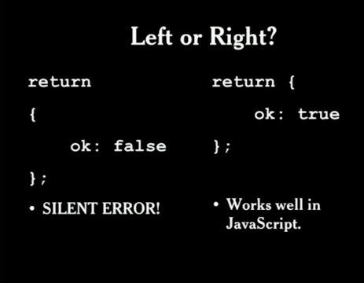

# Programming Style & Your Brain

## JSLint

* É uma ferramenta de qualidade para JavaScript que lê o programa escrito e indica pontos (bad parts) que poderão resultar em erros, alertando ao programador como fazer um código melhor.

## Automatic semicolon insertion [bad part javascript]

  * Permite que você não necessite colocar o ; no final da linha, pois ele adiciona para você, mas isto pode ser um PROBLEMA! Uma vez que você não controla onde ele vai colocar.
  No exemplo da imagem a baixo, o ; seria automaticamente adicionado depois da palavra "return", o que geraria um bug, uma vez que não seria retornado o objeto como esperado. Então, sempre coloque a abertura das  {} no lado direito! Assim, não se corre o risco de uma inserção automática de ; ocorrer no local errado.

  

 

## Switch statement [bad part javascript]
??? Não entendi o pq ele considerou ruim.

## Use space to disambiguate parens [good part]

  * Ao crir funções ou chamar funções, não coloque espaço entre o nome da função e os ()
 
 ```
  funtion exemplo(){
    //não tem espaço entre o nome da funcção e os ()
  }
 ```

  * Ao usar um statement, adicionar espaço entre o statement e os (). Como na declaração de um if: if (true){...}; ou na declaração de um return: return (a+b);

  ```
  if (true) {
    return (a+b) / c;  
  }

  //aqui tanto o if quanto o return são separados por um espaço do () pois se tratam de statements
  
  ```