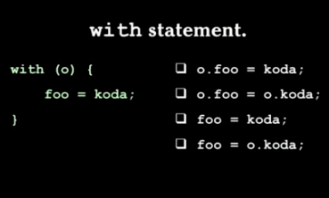
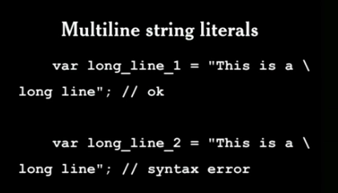
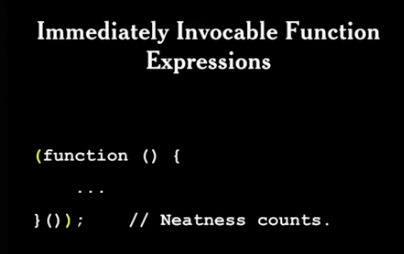
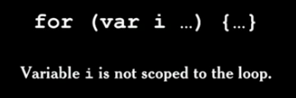
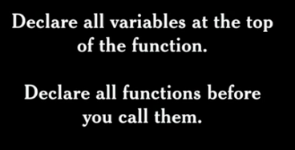

# **Programming Style & Your Brain**

## JSLint

* É uma ferramenta de qualidade para JavaScript que lê o programa escrito e indica pontos (bad parts) que poderão resultar em erros, alertando ao programador como fazer um código melhor.
_______________________________

## **Dicas e truques de style programming para JavaScript**

### **Use space to disambiguate parens**

  * Ao crir funções ou chamar funções, não coloque espaço entre o nome da função e os ()
 
 ```
  funtion exemplo(){
    //não tem espaço entre o nome da funcção e os ()
  }
 ```

  * Ao usar um statement, adicionar espaço entre o statement e os (). Como na declaração de um if: if (true){...}; ou na declaração de um return: return (a+b);

  ```
  if (true) {
    return (a+b) / c;  
  }

  //aqui tanto o if quanto o return são separados por um espaço do () pois se tratam de statements
  
  ```

### **Automatic semicolon insertion [bad part javascript]**

  * Permite que você não necessite colocar o ; no final da linha, pois ele adiciona para você, mas isto pode ser um PROBLEMA! Uma vez que você não controla onde ele vai colocar.
  No exemplo da imagem a baixo, o ; seria automaticamente adicionado depois da palavra "return", o que geraria um bug, uma vez que não seria retornado o objeto como esperado. Então, sempre coloque a abertura das  {} no lado direito! Assim, não se corre o risco de uma inserção automática de ; ocorrer no local errado.

  


### **Switch statement**

* Não entendi o pq ele considerou ruim.


### **With statement**

 * é altamente recomendado não utilizar o with statement pois os resultados dele são imprevisíveis. A cada vez que ele executa o resultado pode ser diferente, como mostrado na imagem:




### **Multiline string literals**

* Este recurso pode apresentar um erro de sintaxe caso fique um espaço no final da sentença, no caso da imagem de exemplo "This is a \ ". Mas este erro não é algo fácil de se perceber apenas olhando.




### **Double equal**

* o uso de == pode resultar em falso positivo, uma vez que ele permite que os valore a serem comparados sejam convertidos para um tipo comum, o que pode gerar um erro na comparação.
* o conselho é de sempre usar o  === pois ele irá considerar os tipos na comparação, e se antes mesmo de olhar para o valor, os tipos forem diferentes o retorno já será falso.


### **Immediately Invocable Function Expressions**

* A função imediata, é executada logo depois de ser criada. A vantagem desta técnica é o encapsulamento, onde o escopo criado pela função é usada para impedir o hoisting das variáveis e funcções que podem estar dentro dela.




### **Scope**

* Em JavaScript temos o escopo definido pela função e não pelo bloco (assim como ocorre em outras linguagens), e isto gera muita confução ao entender o escopo das variáveis.
Tanto as funções quanto os blocos em JavaScript são definidos pelo uso de {}, mas apenas os {} que delimitam uma função é que indicam um escopo. Os demias são apenas blocos e não delimitam um escopo só para eles.




### **Var statement**

* Parte da confusão que acontece ao tentar entender o Scopo no JavaScript vem da forma como funciona o Statement var.
* O funcionamento do statement var é dividido em duas partes, a definição e a inicialização.
* Ao ter uma variável declarada sem inicialização, esta é movida para o topo da função (evento chamado de hoisting)




### **Let statement**

* Funciona como o var mas não faz hoisting! Isto é, ele respeita o escopo de bloco!

### **Implicite global variables**
* Ao criar uma variável sem o uso das palavras "var" ou "let", o JavaScrip subentende que isto se trata de uma variável global


### **Constructors**

* Existe a convenção de usar a primeira letra do nome da função que será definida como contrutor em maiúsculo (Initial Caps) e nada mais deve ser iniciado com maiúsculo, exatamente para deixar bem evidente que se trata de um construtor

### "++"

* A utilização do ++ pode ter dois resultados, o que pode deixar o código pouco claro. Sendo assim, recomenda-se usar x += 1.
* O **pos-increment** (x++) indica que a variável x será usada com o valor atual e posteriomente será incrementada.
* Já o **pre-increment** (++x) indica que a variável será incrementada antes de ser utilizada, sendo assim ela será incrementada imediatamente.


 


