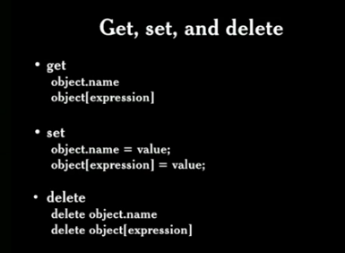
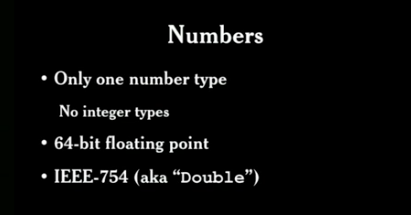
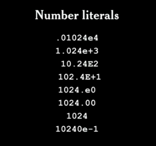
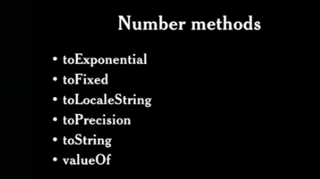
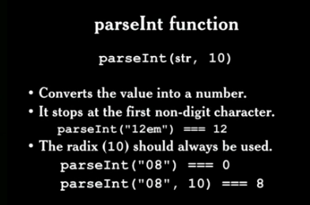
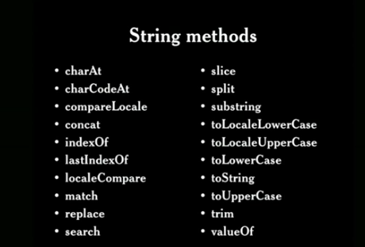
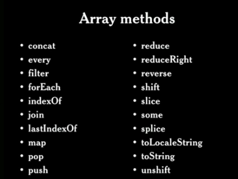

# **And Then There Was JavaScript** by Douglas Crockford

## JavaScript Fundamentals

* JavaScript é uma linguagem orientada à objetos e quase tudo nele é um objeto. Mas para o JavaScrip um objeto é uma coleção dinÂâmica de propriedades;
* Toda propriedade tem uma única key string que é utilizada para retornar os valore;
* Existem 3 operações básicas em um objeto: "Get", "Set" e "Delete";

 

* JavaScript tem objetos literais e foi inspirado no formato JSON;
* Classes vs Prototypes;
* Prototypes customizam ou modificam propriedades de acordo com sua necessidade, produz objetos;
* Delegation ??? (não explicou muito, fiquei meio perdida);
* As Keys devem ser do tipo String (noma da propriedade do objeto);

_______________________________

## Numbers 

* No JavaScript temos apenas um tipo para declarar números

 

* JavaScript tem "number literals", que permite a utilização de casas decimais, notação científica

  

 * Ps numbers também são objetos, e tem um confunto de funções:

 

* NaN (not a nunmber), se comparado com outro NaN o resultado será falso. 
_______________________________

## String and Arrays

* Strings são imutáveis, isto é, não podem ser modificadas. Quando alteramos o valor de uma String, de fato, estamos criando um novo valor em outra parte da memória
* Podem ser escritas com single quotes ' ou com double quotes ".
* Existe uma pegadinha ao converter uma string em numero, ao usar o "parseInt()" quando o valor a ser convertido inicia-se com 0. O parse entende q o zero indica a base 8, e ao tentar ler o restante dos números por não conseguir parsear para a base 8, ele retorna 0. Então é aconselhado deixar explicito que a conversão será em base 10.

   

* String.length é uma propriedade

   

* Arrays são sequências de espaços de memória, que são divididos em tamanhos iguais e acessíveis pelo índice
* Arrays tem uma propriedade length especial, que não indicam a quantidade de elementos no array, ele sempre tem 1 a mais.
* Não é aconselhado utilizar o "for in loop" com array, pois este loop não garante a ordem de acesso aos elementos, podendo gerar problemas ao não acessar os dados na sequência correta

* O método **sort()** ordena os elementos, mas para isto trata seus valores como string, então a ordem pode ficar bem diferente do esperado. Então o ideal é passar uma função de comparação para definir como a ordenação deve ocorrer;
* O método **remove()** do array apenas apaga o valor da posição indicada, deixando aquele espaço como undefined, para reposicionar os demais elementos o ideal será usar o **splice()**, mas isso é bem lento, pois, para não deixar o buraco que o remove deixa, ele pega o próximo elemento, remove e recoloca na posição anterior... e faz isso com o restante do array.

_______________________________

## Objects

* O operador typeof retorna uma string que identifica o tipo do valor. Mas não funciona corretamente para valores nulos, pois ele retorna que o tipo é "object" e isto está errado. Também não identifica corretamente um Array, ele é indicado como Object,, para isto é utilizado o Array.isArray para validar o tipo corretamente. 

* Falsy values : false, null, undefined, "", 0, NaN. Todos os outros valores indicarão truthy, inclusive "0" e "false".
* Objetos são passados por referência, isto é, nunca são copiados, apenas cria-se um ponteiro em memória que aponta para o mesmo objeto

_______________________________

## Common JavaScript Statements

* Identificadores começam com _ ou $
* Todas as variáveis, parâmetros, membros e funções seus nomes iniciam com lower case
* Somente construtures iniciam seu nome com upper case
* Somente variáveos globais são totalmente upper case
* O operador || pode ser usado para preencher variáveis, por exemplo: var last = input || nr_itens (se o valor presente em input for verdadeiro, isto é, não for nulo, undefined, false, NaN ou 0, a variável last receberá seu valor )
* O "Throw" statement pode lançar qualquer coisa, uma string, um objeto, um numero, um erro...
* O "Try" statement somente tem um catch pois como o JavaScript não é fortemente tipado, um só pode receber tudo e posteriormente tratar o que foi recebido 

_______________________________