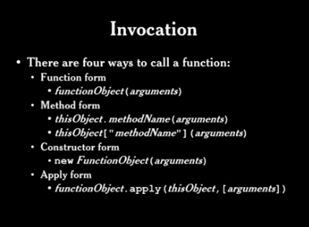

# **Function the Ultimate** by Douglas Crockford

## Background on Functions

  * Funções podem ser declaradas da seguinte maneiras, como function object, onde é atribuída a uma variável, ou como function statement: 

  ```
   var foo = function(){
     return;
   }

   function foo(){
     return;
   }

  ```
  * Boas práticas: Declarar a função antes de chamá-la, declarar variáveis no início da função;
  * Uma função sempre retorna algo, se não estiver explicito o retorno será **undefined**;
  * Construtores tem por default o retorno: **this**;
  * Toda função tem 2 pseudo-parametros que são: **arguments** e **tihs**. Arguments é como um array (mas não é um array) que contêm todos os argumentos que foram enviados na função. **This** contêm a referência para o objeto da invocação.
  * Se uma função receber mais argumentos que a quantidade de parâmetros definidos, eles serão ignorados (mas estarão no arguments) e caso seja enviado uma quantidade menor do que a definida, elas estarão como **undefinded**;
  * Existem 4 formas de chamar uma função: 

  * Quando uma função é chamada no **Constructor form**, um novo objeto é criado e atribuido à **this**, e o **this** que é retornado caso nenhum retorno seja explicitado;
  * O valor do **this** vai depender da maneira como a função foi chamdada: 

_______________________________

## Functions as Subroutines

* **Immediately invoked function**: é um tipo de padrão. Qualquer expressão ou statement pode ser executada dentro de uma Immediately invoked function com excessão o uso de **var, function, break, continue, return, this e argumenst**, isto porque o significado destes statements são alterados dentro deste tipo de função;


* **Closure**: é uma das ideias centrais do JavaScript.
Exemplos de closure, uma utilizando o Immediately invoked e a outra não:

```
//aqui é uma immediately invoked Function
var exemplo = (function(){

    var x = "valor do x";
    
    var y = function(){
        return x;
    }

    return y;
}())

//aqui é a declaração de uma função que será chamada mais tarde
var exemplo2 = function(){

    var x = "valor do x";
    
    var y = function(){
        return x;
    }

    return y;
}

console.log("Immediately: " + exemplo()); // é exibido: "valor de x"
console.log("chamada tardia " + exemplo2()); // é exibido o corpo da função: function(){return x;}

```

_______________________________

## Prototypal Inheritance (A)


_______________________________

## Prototypal Inheritance (B)

* **Function as module**: 
```
  (function (){
    ...
  }());
  
```


_______________________________